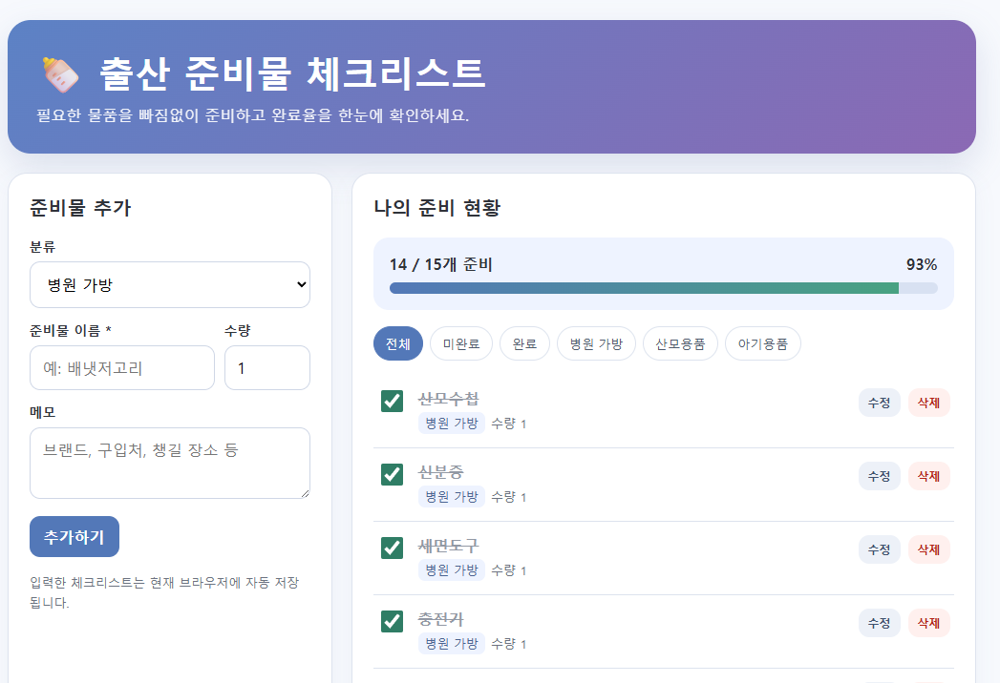

# 임산부 통합 관리 프로그램

임산부가 병원 일정, 출산 준비물, 복약·영양제, 산전검사와 출산·육아 예상비용을 한곳에서 관리할 수 있도록 만든 웹 프로그램입니다. 별도의 설치나 회원가입 없이 HTML 파일을 브라우저에서 실행할 수 있습니다.

## 온라인 실행

[임산부 통합 관리 프로그램 바로 실행하기](https://mamawaitingforyou.github.io/maternal-care-planner/maternal_integrated_app.html)

통합 화면 위쪽의 버튼을 누르면 다섯 가지 프로그램을 한 화면에서 바꾸어 사용할 수 있습니다. 페이지가 열리지 않으면 저장소의 **Settings → Pages**에서 `Deploy from a branch`, `main`, `/(root)`를 선택한 뒤 저장해야 합니다.

## 주요 프로그램

### 1. 임산부 병원 방문 일정 관리

- 병원명, 방문 날짜, 시간, 방문 목적 및 메모 입력
- 다음 방문일까지 남은 날짜(D-day) 표시
- 방문 완료, 일정 수정 및 삭제
- 날짜순 일정 조회와 인쇄

### 2. 출산 준비물 체크리스트

- 병원 가방, 산모용품, 아기용품 등 분류별 관리
- 준비물 이름, 수량 및 메모 입력
- 준비 완료 체크와 전체 완료율 표시
- 준비물 수정, 삭제, 필터링 및 인쇄
- 기본 출산 준비물 목록 제공

### 3. 임산부 복약·영양제 일정 관리

- 약·영양제명, 복용량, 복용 시간과 복용 시점 등록
- 오늘의 복용 일정과 완료 여부 표시
- 복용 일정 수정·삭제 및 브라우저 자동 저장

### 4. 산전검사 일정 체크리스트

- 검사명, 검사 예정일, 임신 주수와 병원명 등록
- 검사일까지 남은 날짜(D-day) 표시
- 검사 완료, 일정 수정 및 삭제

### 5. 출산·육아 예상비용 계산기

- 병원비, 산후조리원비, 출산용품비와 아기용품비 입력
- 전체 예상비용 자동 합산
- 준비한 예산과 비교하여 남은 예산 또는 초과금액 표시

## 입력 → 처리 → 출력

| 구분 | 내용 |
| --- | --- |
| 입력 | 병원·검사 일정, 준비물, 복약정보와 예상비용 입력 |
| 처리 | 입력값 확인, D-day·완료율·전체비용·예산 차액 계산 |
| 출력 | 일정과 체크리스트, 복용 현황, 총 예상비용 표시 |

## 실행 방법

### 인터넷에서 실행

위의 **바로 실행하기** 링크를 누릅니다.

### 컴퓨터에서 실행

1. 저장소의 파일을 내려받습니다.
2. `index.html`을 더블클릭합니다.
3. 원하는 프로그램의 **실행하기** 버튼을 누릅니다.

또는 `maternal_integrated_app.html`을 열면 다섯 가지 기능을 한 화면에서 버튼으로 바꾸어 실행할 수 있습니다.

## 코드 실행 확인

- 모든 HTML 파일의 JavaScript 문법 검사 완료
- 통합 화면과 다섯 프로그램의 파일 연결 검사 완료
- 입력값 저장, 수정·삭제 및 계산 기능을 브라우저 Local Storage 기반으로 구현

## 실행 결과 화면

### 출산 준비물 체크리스트

실행 결과 화면에서는 준비물의 분류, 이름, 수량과 메모를 입력할 수 있습니다. 준비가 끝난 항목을 체크하면 완료된 개수와 전체 준비율이 자동으로 계산됩니다. 위 예시는 15개 항목 중 14개를 준비하여 **93% 완료**로 표시된 결과입니다.

구현된 결과 기능:

- 준비물 분류별 등록
- 준비 완료 여부 체크
- 전체 준비 개수와 완료율 자동 계산
- 전체·미완료·완료·분류별 필터
- 준비물 정보 수정 및 삭제
- 브라우저 자동 저장

각 프로그램 파일을 직접 실행할 수도 있습니다.

- `hospital_visit_schedule.html`: 병원 방문 일정 관리
- `birth_preparation_checklist.html`: 출산 준비물 체크리스트
- `medication_schedule.html`: 복약·영양제 일정 관리
- `prenatal_test_checklist.html`: 산전검사 일정 체크리스트
- `birth_childcare_cost_calculator.html`: 출산·육아 예상비용 계산기
- `maternal_integrated_app.html`: 다섯 가지 기능 통합 실행 화면

## 데이터 저장 방식

입력한 내용은 사용 중인 브라우저의 로컬 저장소(Local Storage)에 저장됩니다. 서버로 전송되지 않으며, 다른 기기나 다른 브라우저에는 자동으로 공유되지 않습니다. 브라우저 데이터를 삭제하면 저장한 내용도 삭제될 수 있습니다.

## 사용 기술

- HTML5
- CSS3
- JavaScript
- Local Storage

## 주의사항

이 프로그램은 일정, 기록과 예산 관리를 위한 학습용 웹 프로그램입니다. 의료진의 진단, 진료 또는 처방을 대신하지 않습니다. 출혈, 심한 복통, 호흡곤란 등 긴급한 증상이 있는 경우 즉시 의료기관 또는 119에 연락해야 합니다.

## 향후 개선 계획

- 임신 주수 계산 기능 연동
- 일정 알림 기능
- 데이터 백업과 불러오기
- 건강 위험도 분류 프로그램 연동
- 모바일 화면 사용성 개선
